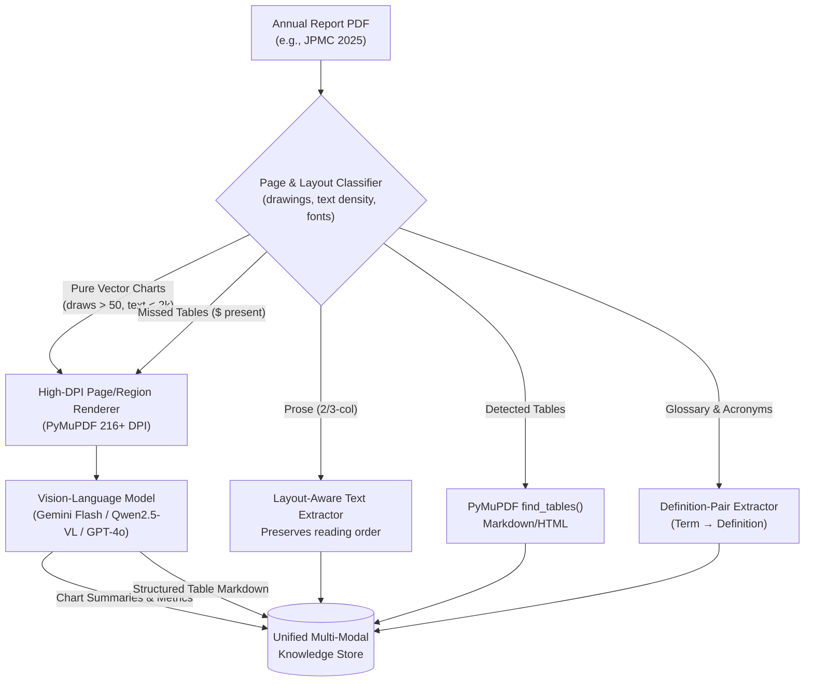

# Multi-Modal RAG: Financial Document Intelligence

A specialized Multi-Modal Retrieval-Augmented Generation (RAG) system engineered to accurately parse, index, and query complex financial reports containing mixed prose, multi-column executive letters, borderless financial tables, and native vector graphics/charts.

---

## 📌 Project Overview

Financial annual reports (such as Form 10-K and Shareholder Reports) present severe challenges for standard text-only RAG pipelines:
1. **Vector-Rendered Visuals:** Key financial charts, performance bars, and trend lines are drawn as native PDF vector operations rather than raster bitmap images (PNG/JPEG). Conventional image extractors find 0 images, while text extractors pull isolated floating numbers without context or axes.
2. **Borderless & Complex Accounting Tables:** Standard table parsers fail when tables lack explicit gridlines, omit row separators, or feature hierarchical/nested column headers.
3. **Multi-Column Prose:** Executive letters frequently utilize 2-column or 3-column newspaper layouts, causing reading order de-linearization in basic scrapers.

This project implements a **Hybrid Document Layout Analysis (DLA) + Vision-Language Model (VLM)** pipeline that intelligently classifies page archetypes and routes each element to specialized extraction and summarization channels.

---

## 📂 Repository Structure

```
.
├── input/
│   ├── jpmc_annualreport-2025.pdf    # JPMorgan Chase & Co. 2025 Annual Report (Primary target)
│   ├── NVIDIA-2024-Annual-Report.pdf # NVIDIA 2024 Annual Report
│   └── apple_10-K-Q4-2023-As-Filed.pdf # Apple 10-K Q4 2023 Filing
├── planning/
│   ├── multimodal_rag_approach.md    # Comprehensive architectural design & archetype analysis
│   └── scratch_analysis.py           # Document profiling and inspection utilities
└── README.md
```

---

## 🔍 Document Analysis & Archetypes (JPMC 2025 Report)

Deep-dive structural analysis of `input/jpmc_annualreport-2025.pdf` (364 pages, 152 TOC bookmarks) revealed **8 distinct page archetypes**:

| # | Archetype | Target Pages | Strategy |
|:---|:---|:---|:---|
| 1 | **Cover & TOC** | 1, 3 | Minimal extraction / navigation indexing |
| 2 | **Financial Highlights Table** | 2, 76 | Borderless tables with multi-tier headers; VLM table extraction |
| 3 | **Shareholder Letter (2-col)** | 4–51 | Layout-aware text extraction with reading-order column reordering |
| 4 | **Senior Executive Letters (3-col)**| 52–74 | Multi-column layout reconstruction |
| 5 | **Pure Vector Charts & Infographics** | 8, 9, 11–13, 77 | High-DPI rendering (3x zoom / 216 DPI) + VLM visual transcription |
| 6 | **MD&A (Mixed Prose & Tables)** | 78–192 | Hybrid: Text extraction + two-pass table detection (rule-based + VLM fallback) |
| 7 | **Audited Financial Statements & Notes** | 193–351 | Dense accounting statements, Notes 1–34, footnote marker re-attachment |
| 8 | **Glossary & End Matter** | 352–364 | Definition-pair key/value extraction (acronyms, terms, directory) |

---

## 🛠️ Architecture & Pipeline



---

## 🚀 Getting Started

### Prerequisites

* Python 3.10+
* [`uv`](https://github.com/astral-sh/uv) package manager

### Environment Setup

```bash
# Clone the repository
git clone https://github.com/maseed260/Multi-modal-RAG.git
cd Multi-modal-RAG

# Install dependencies using uv
uv sync
```

Key dependencies include:
* `pymupdf` (PDF layout extraction, high-resolution rendering, drawing path analysis)
* `pdfplumber` (table and character extraction)
* `pillow`, `pandas`, `numpy`

### Inspect Document Metrics

To run the exploratory document analysis script:
```bash
uv run python planning/scratch_analysis.py
```

---

## 🗺️ Implementation Roadmap

- [x] **Phase 0:** Document profiling, font signatures, vector graphic detection, and archetype identification.
- [ ] **Phase 1:** Prototype extraction on a representative 11-page subset across all 8 archetypes.
- [ ] **Phase 2:** Automated page classifier and two-pass table extraction pipeline.
- [ ] **Phase 3:** VLM prompt engineering for chart decomposition (axes, series, metrics, takeaways).
- [ ] **Phase 4:** Chunking, hierarchical metadata tagging (TOC bookmarks), and vector store indexing.
- [ ] **Phase 5:** Multi-modal query routing, hybrid retrieval, and visual ground-truth answer generation.
