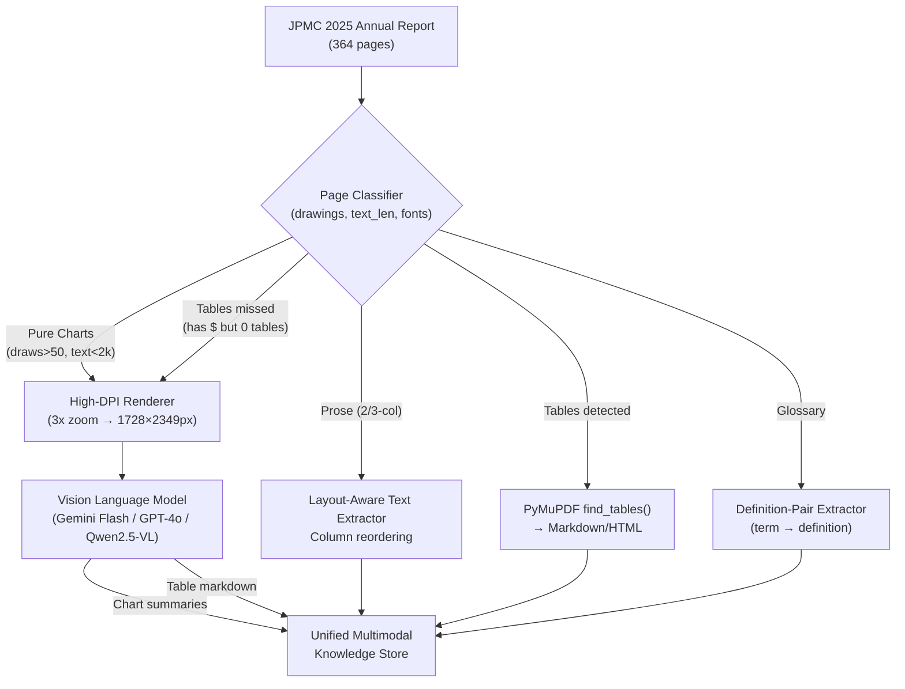

# Multi-Modal RAG: Document Analysis & Parsing Architecture
**Target Document:** `input/jpmc_annualreport-2025.pdf` (JPMorgan Chase & Co. Annual Report 2025)

---

## 1. Document Profile & Characteristics

| Property | Value |
|:---|:---|
| **File Size** | ~4.9 MB |
| **Page Count** | 364 pages |
| **PDF Format** | PDF 1.7 (native vector + font streams; selectable text, not scanned) |
| **Creator** | Adobe Acrobat 25.1.21288 |
| **Raster Images** | 34 total across 25 pages (cover art, executive portraits, branding) |
| **Vector Drawings** | 6,243 drawing paths across 254 pages |
| **TOC Bookmarks** | 152 hierarchical entries |

> **Critical Finding:** Virtually **all financial charts, trend graphs, ROE comparisons, CET1 progressions, and bar charts are native PDF vector paths**, not bitmap images (PNG/JPEG). A standard raster image extraction pipeline (`get_images()`) returns 0 figures for these chart pages. Text extraction on chart pages yields unanchored numbers (`$58.5`, `$57.0`, `24%`, `22%`) with no axis labels, legends, or data-series association.

---

## 2. Document Anatomy: 8 Page Archetypes

| # | Archetype | Pages | Content Description | Parsing Challenge |
|:--|:---|:---|:---|:---|
| 1 | **Cover & TOC** | 1, 3 | Cover image, Table of Contents | Minimal extraction needed; skip or extract TOC links |
| 2 | **Financial Highlights Table** | 2, 76 | Borderless summary tables with multi-tier column headers (e.g. *"Year Ended Dec 31"* spanning 2025/2024/2023) | Both PyMuPDF and pdfplumber detect only **2 rows** instead of ~30. Rule-based parsers fail completely. **VLM table extraction mandatory.** |
| 3 | **Shareholder Letter** (2-col prose) | 4–51 | Jamie Dimon's letter; dense 2-column layout with callout quotes, sidebars, section headers | Column interleaving — standard line-by-line extraction merges adjacent columns horizontally. Layout-aware extraction with column reordering required. |
| 4 | **Senior Executive Letters** (3-col prose) | 52–74 | Business segment essays (CCB, CIB, AWM, Corporate Responsibility); **3-column** layout (x-origins at 36, 202, 368) | Same column-reordering challenge as above, but with 3 columns. Some pages include small embedded charts (e.g. Page 54 has 74 drawings). |
| 5 | **Pure Vector Charts & Infographics** | **8, 9, 11–13, 77** | Net income 20-year trends, EPS progression, ROTCE benchmarks, Five-Year Stock Performance graph | 0 raster images; 50–305 vector drawing paths per page; text < 2000 chars. **Mandatory VLM processing** — render at high DPI and pass to vision model. Identifiable by rule: `drawings > 50 AND text_len < 2000`. |
| 6 | **MD&A (Management Discussion & Analysis)** | 78–192 | Mixed prose + financial tables — Consolidated Results, Balance Sheets, Risk Management, Capital, Credit Exposure | Text extraction works for prose. Table detection catches ~65% of tables; **35% of table-like pages in this range are missed** by `find_tables()`. Two-pass strategy needed. |
| 7 | **Audited Financial Statements & Notes** | 193–351 | Auditor's Report (pp 194–196), Consolidated Statements (pp 197–201), Notes 1–34 (pp 202–346), Supplementary Info (pp 347–351) | Same hybrid challenge. PyMuPDF detects tables on 77 of 146 pages; **41 pages with `$` signs but 0 detected tables**. Footnote markers `(a)`, `(b)`, `*` in 6pt font are frequently detached from their parent rows. |
| 8 | **Glossary & End Matter** | 352–364 | Glossary of Terms & Acronyms (pp 352–359), Board of Directors & Operating Committee (pp 360–362), Shareholder Information (pp 363–364) | Pure definition-pair text (no tables, no charts). Needs definition-pair chunking (term → definition), not paragraph chunking. |

### Font Signatures by Archetype (Classification Signal)

Font families and sizes vary predictably by section and can be used as a **page classification signal**:

| Archetype | Primary Fonts | Size Range |
|:---|:---|:---|
| Chart pages | `AkzidGrtskNext-MedCnd`, `AkzidGrtskNext-LightCnd`, `Sons` family | 3.5–9.5pt |
| Shareholder letter | `TiemposFine-Regular` (serif body), `Sons-Semibold` | 7–26pt |
| Financial tables | `Sons-Bold`, `Sons-Regular` | 4.9–12pt |

---

## 3. Table Extraction: Quantified Failure Analysis

A key risk for this RAG pipeline is the **high miss rate of rule-based table parsers** on this document.

### PyMuPDF `find_tables()` Detection Rates

| Page Range | Section | Tables Detected | Pages with `$` but No Table | Detection Rate |
|:---|:---|:---:|:---:|:---:|
| 76–200 | MD&A | 49 pages | 0 | ~100% (heuristic) |
| 202–347 | Notes to Financial Statements | 77 pages | **41 pages** | **~65%** |

### Root Causes of Failure
1. **No visible grid lines** — Many tables use whitespace alignment only (no `<rect>` or `<line>` PDF operators)
2. **Multi-tier headers** — Column headers spanning multiple sub-columns confuse cell boundary detection
3. **Indent-based row hierarchy** — Parent/child row relationships encoded via left-margin indentation, not separate columns
4. **Cross-page tables** — Tables spanning multiple pages have no repeated headers

### Recommended Two-Pass Strategy
- **Pass 1:** PyMuPDF `find_tables()` — catches the majority
- **Pass 2:** For pages with `$` signs but no detected tables → render to image → VLM table transcription

---

## 4. Parsing & Ingestion Architecture

### Approach A: Hybrid DLA + VLM Summarization *(Recommended)*

1. **Page Classification:**
   - Use drawing count, text length, and font signatures to classify pages into archetypes
   - Rule: `drawings > 50 AND text_len < 2000` → Pure Chart Page
   - Rule: `has_$ AND find_tables() == 0` → Missed Table → VLM fallback
   - Font family detection for section identification

2. **Text Extraction (Archetypes 3, 4, 6, 7):**
   - Layout-aware extraction preserving column reading order
   - PyMuPDF `get_text("blocks")` with x-coordinate sorting for multi-column reordering
   - Consider `pymupdf_layout` package for improved layout analysis

3. **Table Extraction (Archetypes 2, 6, 7):**
   - **Pass 1:** PyMuPDF `find_tables()` for tables with detectable boundaries
   - **Pass 2:** VLM-based table transcription for missed tables (render page region → structured markdown)
   - Preserve multi-level headers, indent hierarchies, and footnote associations

4. **Chart & Visual Extraction (Archetype 5 + fallback):**
   - Render page/region at 3x zoom (216 DPI → 1728×2349px via PyMuPDF)
   - Pass to VLM with structured extraction prompt:
     - Chart title & type (bar, line, scatter, etc.)
     - X/Y axes, units, time horizons
     - Key quantitative data points and comparative trends
     - Executive summary of the visual insight

5. **Glossary Extraction (Archetype 8):**
   - Parse definition pairs (acronym/term → definition)
   - Index as structured key-value pairs for exact-match retrieval

6. **Unified Indexing:**
   - Store structured text, table markdown, VLM chart summaries, and definition pairs
   - Metadata per chunk: `page_number`, `section_title`, `archetype`, `modality` (`text`|`table`|`figure`|`definition`), `year_context`

### Approach B: Visual Document Retrieval (ColPali / Late Interaction)
- Render all 364 pages to images
- Pass into a vision late-interaction retrieval model (e.g., ColPali / PaliGemma)
- Retrieve matching page patches directly via multi-vector representations
- **Trade-off:** Eliminates extraction failures entirely; requires GPU infra and higher memory/storage footprint

### Approach C: End-to-End VLM Page Transduction
- Render pages as high-resolution images
- Prompt a fast multimodal LLM (e.g., Gemini Flash) page-by-page to generate structured Markdown
- **Trade-off:** Uniform output across all archetypes; higher API cost (~364 API calls) unless batched or targeted to specific sections

---

## 5. Phased Implementation Roadmap

### Phase 1: Prototype on Representative Subset
Process one page from **every archetype** to validate the full pipeline:

| Page | Archetype | Why Selected |
|:---|:---|:---|
| 2 | Financial Highlights Table | Borderless table — tests VLM table fallback |
| 5 | Shareholder Letter (2-col) | Dense 2-column prose — tests column reordering |
| 8 | Pure Vector Chart | 150 drawings, 0 images — tests VLM chart extraction |
| 11 | Pure Vector Chart | 175 drawings, complex multi-series chart |
| 16 | Shareholder Letter (2-col) | Mid-letter page with mixed formatting |
| 52 | Senior Exec Letter (3-col) | 3-column layout — tests 3-col reordering |
| 76 | Three-Year Summary Table | Borderless financial table |
| 85 | MD&A Table (missed by parser) | `find_tables()` returns 0 despite clear tabular data |
| 197 | Consolidated Income Statement | Core audited financial table |
| 210 | Notes (fair value hierarchy) | Complex multi-level table with footnotes |
| 352 | Glossary | Definition-pair text |

### Phase 2: Parsing Pipeline Development
- Implement page classifier (drawing count + text length + font heuristics)
- Implement layout-aware text extraction with column reordering
- Implement two-pass table extraction (rule-based + VLM fallback)
- Implement high-DPI chart rendering + VLM captioning
- Implement glossary definition-pair extractor

### Phase 3: Chunking & Metadata Enrichment
- Hierarchical section-aware chunking leveraging the 152-item TOC bookmarks
- Metadata tagging: `page_number`, `section_title`, `archetype`, `modality`, `year_context`
- Footnote re-attachment: link `(a)`, `(b)`, `*` markers to their definitions
- Cross-page table merging where applicable

### Phase 4: Embedding & Vector Storage
- Choose embedding model (Dense + Sparse hybrid, or multimodal embeddings)
- Index into Vector DB (e.g., Chroma, LanceDB, FAISS, or Qdrant)
- Store original page images alongside text chunks for retrieval-time visual grounding

### Phase 5: Multi-Modal Retrieval & Generation (RAG)
- Query routing: classify incoming queries by expected modality (numerical trend → chart chunks, accounting detail → table chunks, strategic narrative → text chunks)
- Multi-modal context assembly: inject text excerpts, table markdown, and figure summaries/visual crops into the LLM prompt
- Citations with page numbers and visual evidence
- Answer verification against source page images
